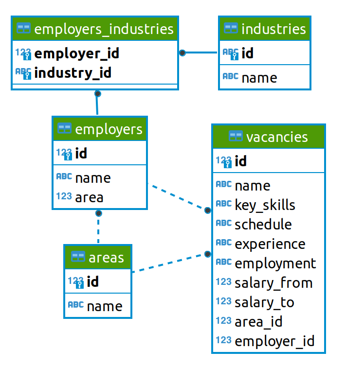
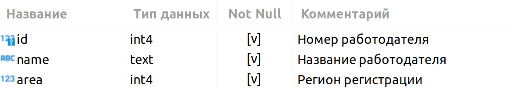
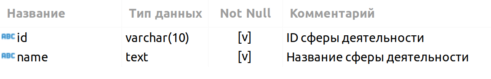
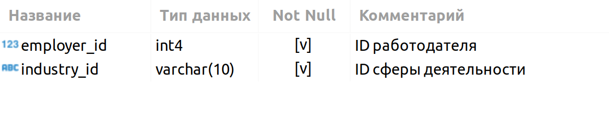

# 
 Анализ вакансий из HeadHunter (Progect 2).

## Оглавление
- [ Анализ вакансий из HeadHunter (Progect 2).](#-анализ-вакансий-из-headhunter-progect-2)
  - [Оглавление](#оглавление)
  - [Описание проекта](#описание-проекта)
  - [Краткое описание данных](#краткое-описание-данных)
  - [Постановка задач:](#постановка-задач)
  - [Этапы работы над проектом](#этапы-работы-над-проектом)
  - [Результат](#результат)
## Описание проекта
В данном блокноте представлено решение части реальной бизнес  задачи, выполненное применяя навыки и знания полученные на курсах "Профессия Data science" от SkillFactory

[Назад](#оглавление)
## Краткое описание данных

Все необходимые таблицы находятся в схеме public базы данных project_sql:

**1**. **VACANCIES**

Таблица хранит в себе данные по вакансиям и содержит следующие столбцы:

Зарплатная вилка — это верхняя и нижняя граница оплаты труда в рублях (зарплаты в других валютах уже переведены в рубли). Соискателям она показывает, в каком диапазоне компания готова платить сотруднику на этой должности.

**2**. **AREAS**

Таблица-справочник, которая хранит код региона и его название.

**3**. **EMPLOYERS**

Таблица-справочник со списком работодателей.

**4**. **INDUSTRIES**

Таблица-справочник вариантов сфер деятельности работодателей.

 

**5**. **EMPLOYERS_INDUSTRIES**

Дополнительная таблица, которая существует для организации связи между работодателями и сферами их деятельности.

Эта таблица нужна нам, поскольку у одного работодателя может быть несколько сфер деятельности (или работодатели могут вовсе не указать их). Для удобства анализа необходимо хранить запись по каждой сфере каждого работодателя в отдельной строке таблицы.

[Назад](#оглавление)
## Постановка задач:
⭐ Компания HeadHunter хочет создать модель машинного обучения, которая будет рекомендовать вакансии клиентам агентства, претендующим на позицию Data Scientist.
> Для этого необходимо понять, что из себя представляют данные и насколько они соответствуют целям проекта. В литературе эта часть работы над ML-проектом называется Data Understanding, или анализ данных.

[Назад](#оглавление)
## Этапы работы над проектом
проект включает в себя несколько этапов:
1. Знакомство с данными;
2. Предварительный анализ данных;
3. Детальный анализ вакансий;
4. Анализ работодателей;
5. Предметный анализ.

Каждая часть состоит из блока практических заданий, выполненных в *jupyter* - ноутбуке и контрольных вопросов, наводящие к решению задачи.

[Назад](#оглавление)
## Результат
Общие выводы по проекту.

[Назад](#оглавление)